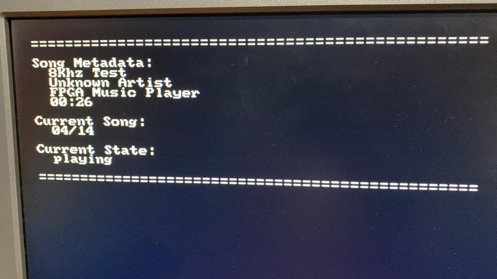
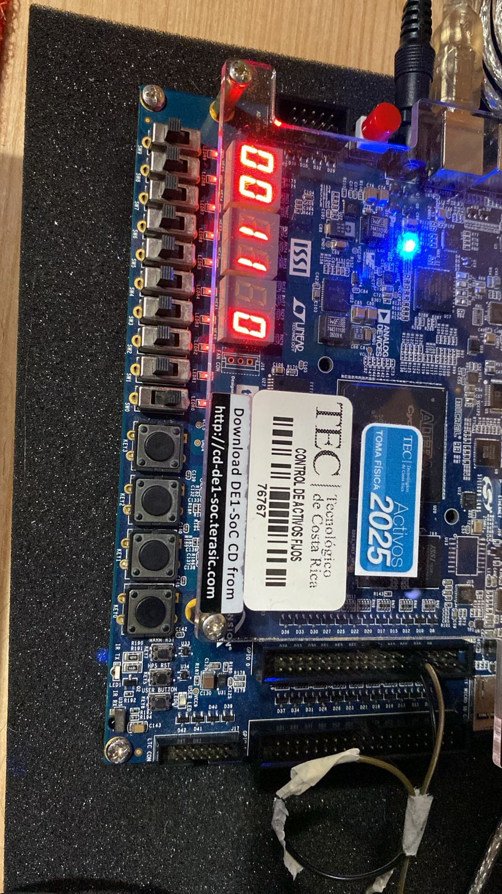
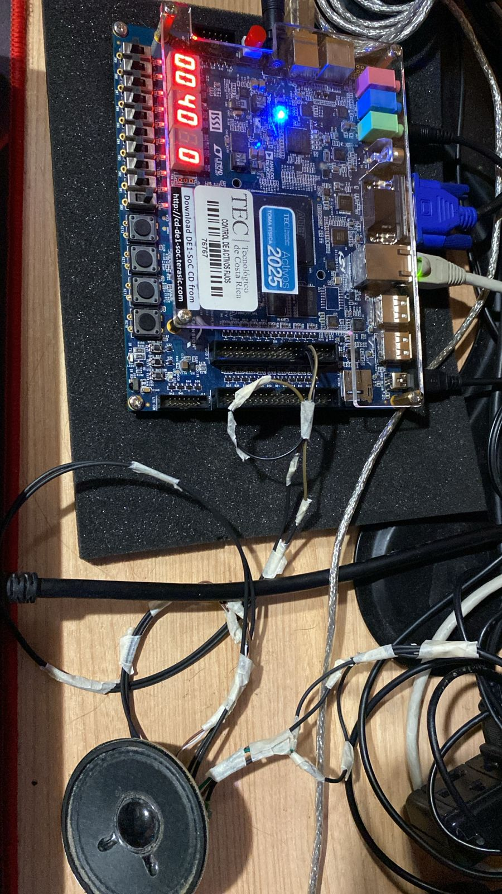
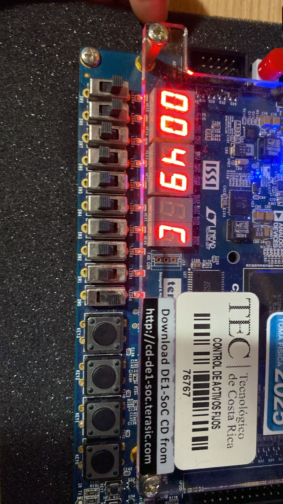
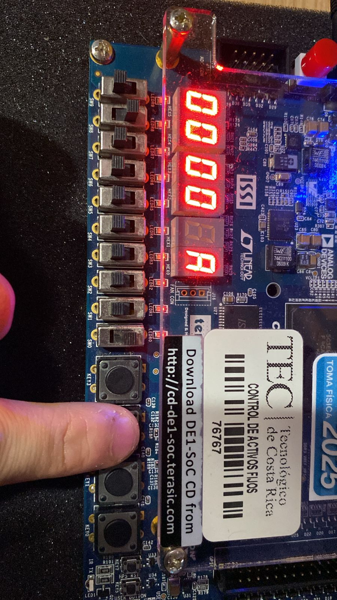
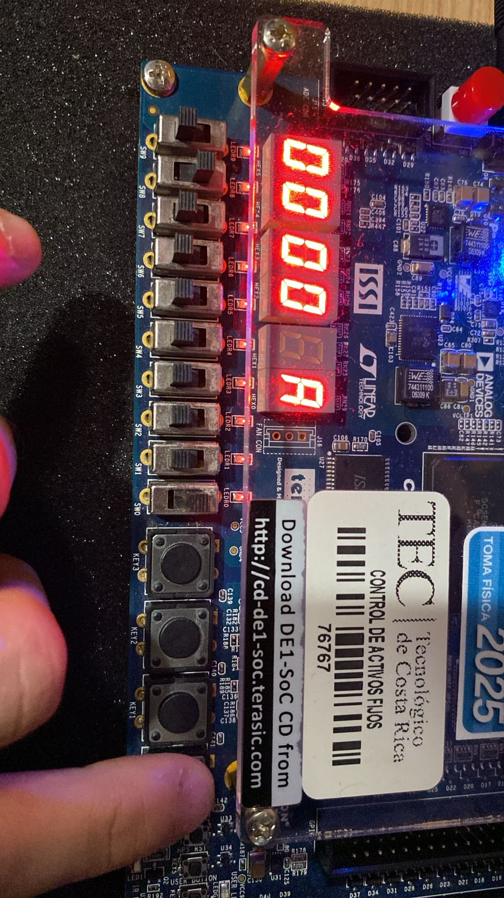
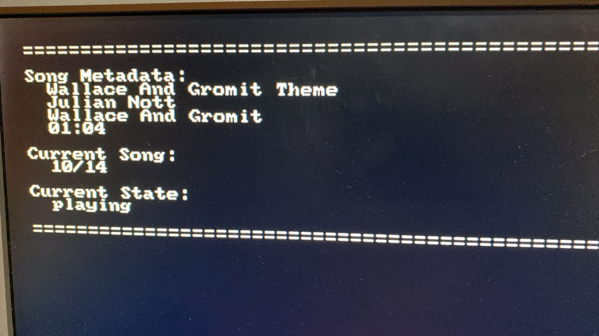
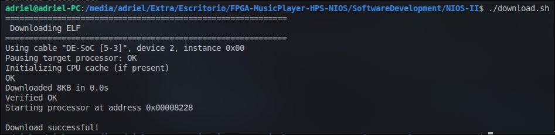
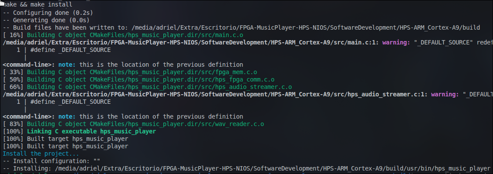

# Evidence

Photographic evidence of the complete system running on hardware: FPGA fabric
programmed at boot, Nios II firmware driving audio/VGA/7-seg, and the HPS
daemon serving songs over the shared-memory bridge.

7-segment format: `MM SS` elapsed playback time on HEX5–HEX2, and the active
audio filter (`A` / `b` / `C`) on HEX0.

---

## 1. VGA — Song Metadata

The VGA display rendering live metadata from the shared-memory protocol:
title, artist, album, duration (`8Khz Test`, 00:26), current song index
(04/14), and playback state (`playing`).

## 2. Full System Running — No User Interaction

The DE1-SoC with the complete system loaded and playing autonomously:
the 7-seg displays show the advancing playback timer and the active filter.
No JTAG, no host PC — everything started from power-on.

## 3. Wide Shot — Audio Output

Wider view of the same setup showing the audio output hardware used to
reproduce the sound during playback.

## 4. Filter C (Reverb) Active During Playback

Close-up with filter `C` (reverb) selected on HEX0 while a song plays —
the timer (`00:49`) has advanced, confirming filtering happens live on the
audio stream without interrupting playback.

## 5. User Action — Stop

Result of pressing **stop**: the playback timer resets to `00:00`, with
filter `A` (low-pass) selected.

## 6. User Action — Next Song

Result of pressing **next song**, captured right after the track change
(timer restarted, same display state as the previous capture).

## 7. VGA — Updated Song Info

The VGA display after track navigation, showing the new song's metadata
(`Wallace And Gromit Theme`, Julian Nott, 01:04, song 10/14, `playing`) —
proving the HPS → Nios II → VGA metadata path updates correctly.

## 8. Nios II Firmware — Final Build & Load

Successful build and load of the final Nios II firmware: the `.elf` is
downloaded over JTAG (`Downloaded 8KB`, `Verified OK`) and the processor
starts execution.

## 9. HPS Daemon — Final Cross-Compilation

Successful cross-compilation of the final `hps_music_player` binary with
the Yocto SDK: all five modules compile, link, and install
(`build/usr/bin/hps_music_player`) ready for deployment to the board.

## 10. Video Link

[Watch the demo video on YouTube](https://youtu.be/9sqR-va31KU)